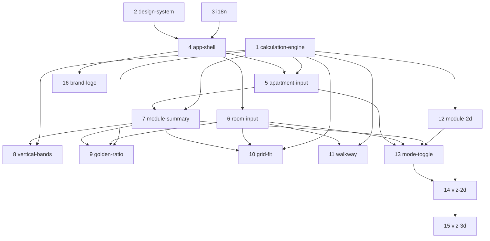

# Capability Plan — OpenSpec change sequence

Last updated: 2026-07-03

This document splits [docs/PDR.md](PDR.md) into **capabilities**, each implemented as
one **OpenSpec change**, and fixes the **order of implementation**. It is the bridge
between the requirement IDs in the PDR and the changes you scaffold with
`openspec new change`.

- **PDR** = *what* to build and *how to verify it* (the `FR-*`/`NFR-*`/`TC-*`/`BC-*` IDs).
- **This plan** = *in what order* and *as which OpenSpec change*.
- **Each OpenSpec change** = proposal + design + tasks for one capability, traced back
  to the PDR IDs listed in its card below.

> Scope note: **Changes 1 `calculation-engine`, 2 `design-system`, 3 `i18n`, 4 `app-shell`,
> 5 `apartment-input`, and 6 `room-input` are shipped** (2026-07-03). Change 1: [lib/calculations.ts](../lib/calculations.ts)
> + its `node:test` suite; runner is `node --test lib/*.test.ts` (Node **native TS
> type-stripping** — the `tsx` loader from [ADR-0001](adr/0001-test-runner.md) was **dropped
> as redundant** on Node 22.22, ADR amended 2026-07-03). Change 2:
> [app/globals.css](../app/globals.css) — DESIGN §3 OKLCH token system (light/dark, `@theme
> inline`, motion, focus, `--header-h`) and [app/layout.tsx](../app/layout.tsx) self-hosts
> Inter + JetBrains Mono via `next/font`. Change 3:
> [locales/en.json](../locales/en.json)+[ua.json](../locales/ua.json), pure
> [lib/i18n.ts](../lib/i18n.ts), [lib/i18n-context.tsx](../lib/i18n-context.tsx)
> (`LanguageProvider`/`useI18n`), [components/LanguageToggle.tsx](../components/LanguageToggle.tsx).
> Change 4: [app/page.tsx](../app/page.tsx) (Server) → [components/Calculator.tsx](../components/Calculator.tsx)
> (single client boundary + state owner, mounts the provider) → [components/Shell.tsx](../components/Shell.tsx)
> (responsive header + two-column layout + validity-gated results) + [components/ThemeToggle.tsx](../components/ThemeToggle.tsx)
> + pure [lib/app-state.ts](../lib/app-state.ts). Change 5:
> [components/ApartmentForm.tsx](../components/ApartmentForm.tsx) fills the apartment slot
> (ceiling/opening/module + inline validation) and `lib/app-state.ts` gained `moduleTouched`
> + the `withCeiling`/`withOpening`/`withModule` reducers (module follows the suggestion until
> overridden). Change 6: [components/RoomList.tsx](../components/RoomList.tsx) fills the rooms
> slot (add/remove/edit rooms + inline validation) and `lib/app-state.ts` gained the
> `addRoom`/`removeRoom`/`updateRoom` reducers + `newRoomId`. The **results region remains an
> empty slot** awaiting changes 7–11. `@react-three/fiber` + `@react-three/drei` + `three` are
> already installed. `TC-STACK-01` is `accepted`; changes 1–6 are `shipped`; everything else is
> `proposed`.

---

## 1. How this maps to OpenSpec

One **capability = one OpenSpec change**. When you pick up a change, run the proposal
flow (`/opsx:propose` or `openspec new change <id>`) using the **kickoff** line in its
card, then implement with `/opsx:apply`, then `/opsx:archive`.

Two decomposition rules keep the mapping clean:

1. **Logic vs. presentation split.** The pure math lives in one foundational change
   (`calculation-engine`) that owns the **function contracts** (`suggest*`/`compute*`
   signatures, returned fields, numeric correctness, `NFR-PURE-01`/`NFR-TEST-01`). Each
   later capability change owns the **presentation/interaction** of those values. Where a
   single `FR-*` spans both, its card annotates `(engine)` vs `(ui)`.
2. **Cross-cutting constraints are not standalone changes.** `NFR-*`, `TC-*`, and `BC-*`
   are verified *inside* the capability changes they touch — see the coverage matrix in
   §6.

---

## 2. Capability → change map

| # | OpenSpec change id | Capability (PDR) | Epic | MoSCoW |
|---|--------------------|------------------|------|--------|
| 1 | `calculation-engine` | (cross-capability pure math) | A · Core | Must |
| 2 | `design-system` | (shell foundation) | A · Core | Must |
| 3 | `i18n` | `i18n` | A · Core | Must |
| 4 | `app-shell` | Shell & layout | A · Core | Must |
| 5 | `apartment-input` | `apartment-input` | A · Core | Must |
| 6 | `room-input` | `room-input` | A · Core | Must |
| 7 | `module-summary` | `module` | A · Core | Must |
| 8 | `vertical-bands` | `vertical-bands` | A · Core | Must |
| 9 | `golden-ratio` | `golden-ratio` | A · Core | Must |
| 10 | `grid-fit` | `grid-fit` | A · Core | Must |
| 11 | `walkway` | `walkway` | A · Core | Should |
| 12 | `module-2d` | `module-2d` | B · Visualization | Must (iter 2) |
| 13 | `mode-toggle` | `mode-toggle` | B · Visualization | Must (iter 2) |
| 14 | `viz-2d` | `viz-2d` | B · Visualization | Must (iter 2) |
| 15 | `viz-3d` | `viz-3d` | B · Visualization | Should (iter 2) |
| 16 | `brand-logo` | `brand` | B · Visualization | Must (iter 2) · parallelizable |

---

## 3. Recommended implementation order

This is the headline answer. Build **top to bottom**; items at the same indent are
independent and may be parallelized.

```
Epic A — Core Calculator (MVP)
  Phase 0 · Foundations        1. calculation-engine ─┐ (parallel)
                               2. design-system       │
                               3. i18n               ─┘
                               4. app-shell           (needs 2 + 3)
  Phase 1 · Inputs             5. apartment-input      (needs 4 + 1)
                               6. room-input           (needs 4)
  Phase 2 · Module linchpin    7. module-summary       (needs 5 + 1)
  Phase 3 · Result sections    8. vertical-bands  ─┐
                               9. golden-ratio     │ (parallel, each needs 7 + 1)
                              10. grid-fit         │
                              11. walkway         ─┘ (needs 6 + 1)

Epic B — Mode toggle + Visualizers + Logo (iteration 2)
                              12. module-2d            (needs 1)
                              13. mode-toggle          (needs 5 + 6 + 7 + 12)
                              14. viz-2d               (needs 13 + 12)
                              15. viz-3d               (needs 14)
                              16. brand-logo           (needs 4 — parallelizable any time)
```

**Why this order**

- **Pure math first (1).** `calculation-engine` has no UI and is 100% unit-testable
  (`NFR-PURE-01`/`NFR-TEST-01`). Proving the hardest part — GCD module suggestion,
  golden split, grid fit, bands — before any pixels exist de-risks everything downstream
  and lets the UI changes stay thin.
- **Frame before content (2–4).** Nothing renders a string without `i18n`, and nothing
  renders legibly without `design-system`; both feed `app-shell`, which establishes the
  single `'use client'` boundary (`TC-CLIENT-01`) and the state owner (`TC-ARCH-01`).
- **Inputs before results (5–6).** Results only render when inputs are valid
  (`FR-SHELL-04`); the inputs produce the state that every result reads.
- **Module is the linchpin (7).** Every downstream result uses the *active module*
  (`FR-MODULE-02`), so it must exist and be selectable before bands/golden/grid render.
- **Result sections fan out (8–11).** Once the active module + inputs exist, the four
  result sections are mutually independent and can be built in any order or in parallel.
- **Visualization is additive (12–16).** Iteration 2 layers a mode toggle and read-only
  visualizers on top of a working calculator. `module-2d` is a pure engine extension;
  `viz-2d` must precede `viz-3d` because the 2D view is the 3D fallback
  (`FR-VIZ3D-06`/`NFR-BUNDLE-01`). `brand-logo` depends only on the header slot and can
  land any time after `app-shell`.

---

## 4. Dependency graph



---

## 5. Per-change cards

Each card lists the PDR IDs the change is accountable for, its dependencies, the reason
for its slot in the order, the signal that it's done, and the OpenSpec kickoff command.

### Epic A — Core Calculator (MVP)

#### 1. `calculation-engine` — pure proportioning math *(Must)* — ✅ **shipped 2026-07-03**
- **Shipped:** archived at
  [openspec/changes/archive/2026-07-03-calculation-engine/](../openspec/changes/archive/2026-07-03-calculation-engine/);
  spec synced to `openspec/specs/calculation-engine/spec.md`. 25 `node:test` cases green;
  review 0 critical/0 high; QA 19/19 implemented & spec-compliant, 16/19 auto-tested.
- **Covers:** `FR-MODULE-01`, `FR-VERT-01/02/03/04` (engine), `FR-GOLD-01/02/03` (engine),
  `FR-GRID-01/02/03/04` (engine), `FR-WALK-01/02/03` (engine); `NFR-PURE-01`,
  `NFR-TEST-01`, `NFR-PERF-01`, `NFR-PERF-02`.
- **Delivers:** `lib/calculations.ts` — `STANDARD_MODULES`, shared types, validation
  bounds, snapping helpers, `suggestModule`, `computeVerticalBands`,
  `computeGoldenSplit`, `computeRoomGrid`, `computeWalkways`; plus the test runner
  (Node `node:test`, native TS type-stripping — `tsx` dropped, [ADR-0001](adr/0001-test-runner.md)
  amended) and the unit suite (normal, boundary, edge cases: coprime heights, variable band
  counts, off-grid openings, 1 mm-short dimensions, snap residuals).
- **Decisions baked in (from design-explore):**
  - **Test runner** — Node `node:test` run directly via native TS type-stripping
    (`node --test lib/*.test.ts`); the `tsx` loader was dropped as redundant on Node 22.22
    ([ADR-0001](adr/0001-test-runner.md) amended 2026-07-03). No test dependency added.
  - **`STANDARD_MODULES` is one swappable constant** and every snap goes through a single
    helper; `residual` is always returned and always surfaced so a poor suggestion is
    visible, never silent ([ADR-0002](adr/0002-standard-modules-swappable-constant.md)).
    `OQ-01` (the authoritative values) stays open but does **not** block this change —
    a later revision is a one-line constant + fixture edit.
- **Depends on:** nothing.
- **Why here:** highest-leverage, lowest-risk, no UI — proves the numbers first. Maps to
  the `calculation-logic` skill and `DESIGN.md` §10/§12/§13.
- **Done when:** every function returns the worked-example numbers and the suite is green;
  zero framework imports in the file (`NFR-PURE-01`); `STANDARD_MODULES` defined once and
  `residual` surfaced ([ADR-0002](adr/0002-standard-modules-swappable-constant.md)).
- **Kickoff:** `openspec new change calculation-engine`

#### 2. `design-system` — visual foundation *(Must)* — ✅ **shipped 2026-07-03**
- **Shipped:** archived at
  [openspec/changes/archive/2026-07-03-design-system/](../openspec/changes/archive/2026-07-03-design-system/);
  spec synced to `openspec/specs/design-system/spec.md`. Build ✓, `eslint app/` ✓; review
  clean (0 crit/high/med, 1 low). **Caveat:** NFR-A11Y-02 is *partial* — body/label/muted
  text passes AA in both themes, but the frozen `--faint` / `--accent`-on-`--bg` tokens are
  sub-AA (CR-001), tracked as a downstream token-usage constraint.
- **Covers:** `TC-STACK-02`, `TC-STACK-03`, `NFR-A11Y-02`.
- **Delivers:** rewrite `app/globals.css` with the OKLCH light/dark tokens, Inter /
  JetBrains Mono wiring (mono-for-numbers rule), dark-mode variants, base type scale;
  removes create-next-app boilerplate. Maps to the `design-tokens` skill, `DESIGN.md`
  §1–3/§8–9.
- **Depends on:** nothing (parallel with 1, 3).
- **Why here:** every UI change consumes these tokens; building them once avoids churn.
- **Done when:** AA contrast holds in both themes; numeric values render in mono.
- **Kickoff:** `openspec new change design-system`

#### 3. `i18n` — bilingual UA/EN plumbing *(Must)* — ✅ **shipped 2026-07-03**
- **Shipped:** archived at
  [openspec/changes/archive/2026-07-03-i18n/](../openspec/changes/archive/2026-07-03-i18n/);
  spec synced to `openspec/specs/i18n/spec.md`. Suite 34/34, build ✓, tsc ✓, lint ✓; review
  clean (0 crit/high/med, 2 low resolved). QA 4/4 implemented & spec-compliant. The
  `LanguageProvider` is not yet mounted — `app-shell` (4) mounts it and places the toggle
  (`FR-SHELL-03`).
- **Covers:** `FR-I18N-01/02/03`, `TC-I18N-01`.
- **Delivers:** `LanguageContext` (`locale` + `t(key)`), `locales/en.json` +
  `locales/ua.json` (flat dictionaries), the never-translate rule for calc labels
  (¼M, ½M, M…). Maps to the `i18n-strings` skill, `DESIGN.md` §11.
- **Depends on:** nothing (parallel with 1, 2).
- **Why here:** no user-facing string renders without `t()`; the shell needs it.
- **Done when:** all strings resolve through `t()`; switching locale re-renders live.
- **Kickoff:** `openspec new change i18n`

#### 4. `app-shell` — page shell, client boundary, layout *(Must)* — ✅ **shipped 2026-07-03**
- **Shipped:** archived at
  [openspec/changes/archive/2026-07-03-app-shell/](../openspec/changes/archive/2026-07-03-app-shell/);
  spec synced to `openspec/specs/app-shell/spec.md`. Suite 44/44, build ✓, tsc ✓, lint ✓;
  review clean (0 crit/high/med, 3 low resolved). QA 9/9 implemented & spec-compliant.
  Input column + results region are **empty slots** for changes 5–11; NFR-RESP-01 / NFR-A11Y-01
  are partial (band SVG and editable-field labels arrive with later capabilities).
- **Covers:** `FR-SHELL-01/02/03/04`, `TC-CLIENT-01`, `TC-ARCH-01`, `NFR-RESP-01`,
  `NFR-A11Y-01`, `NFR-PERF-01`.
- **Delivers:** `page.tsx` stays a Server Component; `Calculator.tsx` is the single
  `'use client'` boundary owning `ApartmentInput` state; input column + live results
  panel; responsive stacking → side-by-side; results gated on full validity
  (`FR-SHELL-04`); language toggle slot top-right. Maps to `design-layout-components`,
  `DESIGN.md` §4.
- **Depends on:** `design-system`, `i18n`.
- **Why here:** the container every input and result plugs into; defines state ownership.
- **Done when:** empty shell renders responsively in both locales; results panel hidden
  until inputs valid.
- **Kickoff:** `openspec new change app-shell`

#### 5. `apartment-input` — ceiling / opening / module fields *(Must)* — ✅ **shipped 2026-07-03**
- **Shipped:** archived at
  [openspec/changes/archive/2026-07-03-apartment-input/](../openspec/changes/archive/2026-07-03-apartment-input/);
  spec synced to `openspec/specs/apartment-input/spec.md`. Suite 50/50, build ✓, tsc ✓, lint ✓;
  review clean (0 crit/high/med, 2 low resolved). QA 5/5 implemented & spec-compliant, 3/5
  automated. `FR-APT-03`'s "module follows the suggestion until overridden, then sticky" rule is
  a pure, fully-tested reducer set (`moduleTouched` + `withCeiling`/`withOpening`/`withModule`).
- **Covers:** `FR-APT-01/02/03/04/05`.
- **Delivers:** ceiling (int, 2800, 2000–5000), opening (int, 2100, 1800–ceiling),
  module dropdown over `STANDARD_MODULES` defaulting to suggested; inline red-border +
  localized message; reactive recompute, no submit button.
- **Depends on:** `app-shell`, `calculation-engine` (bounds, `STANDARD_MODULES`).
- **Why here:** produces the apartment-level state the module engine consumes.
- **Done when:** invalid values block results and show inline errors; valid edits
  recompute synchronously.
- **Kickoff:** `openspec new change apartment-input`

#### 6. `room-input` — room list *(Must)* — ✅ **shipped 2026-07-03**
- **Shipped:** archived at
  [openspec/changes/archive/2026-07-03-room-input/](../openspec/changes/archive/2026-07-03-room-input/);
  spec synced to `openspec/specs/room-input/spec.md`. Suite 56/56, build ✓, tsc ✓, lint ✓; review
  **clean** (0 crit/high/med, 3 low — 1 resolved [visible name label], 1 deferred by design [field
  dedup, YAGNI until a 3rd consumer], 1 acknowledged cosmetic [duplicate default names after
  removal]). QA 4/4 implemented & spec-compliant, 3/4 automated (CRUD + bounds via reducers;
  FR-ROOM-04 form DOM manual per ADR-0001). Last-room-remove guard is enforced in the pure
  `removeRoom` reducer, not only the disabled UI.
- **Covers:** `FR-ROOM-01/02/03/04`.
- **Delivers:** starts with one room; "Add room" appends `{name:"Room N", length:3000,
  width:2400}`; remove any except the last; per-room name (1–50, default "Room N"), length + width
  (500–15000); inline validation matching `FR-APT-04`.
- **Depends on:** `app-shell`.
- **Why here:** produces per-room state for golden/grid/walkway; independent of inputs (5).
- **Done when:** last room cannot be removed; each field validates inline.
- **Kickoff:** `openspec new change room-input`

#### 7. `module-summary` — active module + suggestion display *(Must)*
- **Covers:** `FR-MODULE-02/03/04/05`, `BC-MODULE-01`. *(`FR-MODULE-01` fn from change 1.)*
- **Delivers:** wires `suggestModule` to heights; active module = user selection
  (default `suggested`, overridable, never raw GCD); Module Summary (M large +
  `rawGcd → suggested` hint + `alternatives` + `residual`); ¼M…4M ruler table;
  impractical-module warning banner (> 1000 / < 100 mm).
- **Depends on:** `apartment-input`, `calculation-engine`.
- **Why here:** the linchpin — establishes the *active module* every result reads
  (`FR-MODULE-02`). Must precede all result sections.
- **Done when:** changing the dropdown re-derives all downstream results; suggestion hint
  and warnings show correctly.
- **Kickoff:** `openspec new change module-summary`

#### 8. `vertical-bands` — height-band diagram *(Must)*
- **Covers:** `FR-VERT-01/02/03/04/05/06`, `NFR-RESP-01`.
- **Delivers:** SVG `viewBox="0 0 200 400"` + `preserveAspectRatio`, width-responsive;
  band count `floor(ceiling / m)`; `topRemainder` partial band; off-grid opening marker
  when `openingAligned` is false; mm labels left / band names right; label condensing at
  high band counts.
- **Depends on:** `module-summary`, `calculation-engine`.
- **Why here:** consumes active module + ceiling; first of the fan-out result sections.
- **Done when:** 2-band and 50+-band cases both render legibly and responsively.
- **Kickoff:** `openspec new change vertical-bands`

#### 9. `golden-ratio` — per-room golden split *(Must)*
- **Covers:** `FR-GOLD-01/02/03/04`.
- **Delivers:** golden split applied to the **longer** wall; shows exact, ½M-snapped, and
  `snapOffset`; flags "approximate fit" when offset > ¼M.
- **Depends on:** `module-summary`, `room-input`, `calculation-engine`.
- **Why here:** independent result section; parallel with 8/10.
- **Done when:** exact + snapped values shown per room; large-offset rooms flagged.
- **Kickoff:** `openspec new change golden-ratio`

#### 10. `grid-fit` — room grid fit *(Must)*
- **Covers:** `FR-GRID-01/02/03/04/05`, `NFR-A11Y-02`.
- **Delivers:** modules × modules via `round(dimension / m)`; signed nearest-distance
  remainders ("round up"/"round down"); quality `exact`/`close`/`poor`; colored quality
  badge that never relies on color alone.
- **Depends on:** `module-summary`, `room-input`, `calculation-engine`.
- **Why here:** independent result section; parallel with 8/9.
- **Done when:** a 1 mm-short dimension reads `close`, not `poor`; badge has a text/icon
  cue.
- **Kickoff:** `openspec new change grid-fit`

#### 11. `walkway` — clearance check *(Should)*
- **Covers:** `FR-WALK-01/02/03/04`, `BC-WALK-01`.
- **Delivers:** `available = roomWidth − furnitureDepth − (oppositeDepth ?? 0)`; presets
  600 mm (wardrobe/kitchen) / 900 mm (sofa); fixed mm ratings (≥ 900 comfortable,
  ≥ 600 acceptable, < 600 tight) decoupled from M; guidance-phrased recommendation.
- **Depends on:** `room-input`, `calculation-engine`.
- **Why here:** independent; `Should`, so first to cut under time pressure.
- **Done when:** ratings never scale with M; sub-600 mm reads `tight`.
- **Kickoff:** `openspec new change walkway`

### Epic B — Mode toggle + Visualizers + Logo (iteration 2)

#### 12. `module-2d` — module from room dimensions *(Must, iter 2)*
- **Covers:** `FR-MODULE2D-01/02`.
- **Delivers:** `suggestModule2D(rooms)` — GCD over every room's length & width (single
  room → `gcd(l, w)`), snapped to `STANDARD_MODULES`, with `alternatives`/`residual`;
  the 2D-mode active module that drives golden split, grid fit, and the 2D visualizer.
- **Depends on:** `calculation-engine`.
- **Why here:** pure engine extension; prerequisite for 2D-mode calculations.
- **Done when:** unit-tested like the rest of the engine; matches worked examples.
- **Kickoff:** `openspec new change module-2d`

#### 13. `mode-toggle` — 2D ⇄ 3D calculation mode *(Must, iter 2)*
- **Covers:** `FR-MODE-01/02/03/04/05`, `BC-PRIVACY-01`, `NFR-A11Y-03`.
- **Delivers:** segmented toggle (default 3D); 2D hides height fields and suggests module
  from room dims (change 12); 3D uses heights (change 7); shared state (rooms, names,
  dims, selected module) preserved across switches; mode is in-memory only, never
  persisted; keyboard-operable with a clear selected state.
- **Depends on:** `apartment-input`, `room-input`, `module-summary`, `module-2d`.
- **Why here:** reorganizes the input column; both visualizers hang off it.
- **Done when:** switching modes preserves rooms and reveals/hides height fields; no
  persistence.
- **Kickoff:** `openspec new change mode-toggle`

#### 14. `viz-2d` — read-only SVG plan visualizer *(Must, iter 2)*
- **Covers:** `FR-VIZ2D-01/02/03/04/05`, `NFR-PERF-03`, `BC-VALUE-01`.
- **Delivers:** width-responsive `viewBox` SVG; each room a to-scale rectangle in a
  row/wrap (not a floor plan); faint M × M grid; signed remainder as a thin edge strip;
  exactly one highlighted accent module cell; grid/highlight animation that tweens on
  input change; `prefers-reduced-motion` snaps instead of plays. Read-only — never edits
  geometry, never exports.
- **Depends on:** `mode-toggle`, `module-2d`, `calculation-engine`.
- **Why here:** the 2D view is also the 3D fallback, so it must exist before 3D.
- **Done when:** redraw stays within the < 16 ms budget; reduced-motion respected.
- **Kickoff:** `openspec new change viz-2d`

#### 15. `viz-3d` — lazy 3D module visualizer *(Should, iter 2)*
- **Covers:** `FR-VIZ3D-01/02/03/04/05/06`, `NFR-BUNDLE-01`, `NFR-PERF-03`,
  `TC-STACK-04`, `NFR-A11Y-03`.
- **Delivers:** `@react-three/fiber` canvas lazy-loaded via `next/dynamic`
  (`ssr: false`); one box per room (l × w × ceiling) to scale; opening band when
  provided; one highlighted M³ cube; OrbitControls + gentle auto-rotate + float/fade-in;
  reduced-motion disables auto-rotate/pulse; loading state while the chunk loads; WebGL
  unavailable → graceful message + fallback to `viz-2d`. First paint and the 2D path
  carry no 3D dependency.
- **Depends on:** `viz-2d` (fallback target), `mode-toggle`.
- **Why here:** heaviest, riskiest, and `Should`; degrades gracefully to a shipped 2D view.
- **Done when:** the 2D path's bundle contains no Three.js; WebGL-off devices fall back
  cleanly.
- **Kickoff:** `openspec new change viz-3d`

#### 16. `brand-logo` — golden-ratio SVG logo *(Must, iter 2 · parallelizable)*
- **Covers:** `FR-LOGO-01`.
- **Delivers:** an SVG logo (nested φ:1 rectangles + golden-spiral arc, `currentColor`,
  transparent ground) left of the header title, scaling to a favicon; no raster assets,
  no new dependencies.
- **Depends on:** `app-shell` (header slot) only.
- **Why here:** standalone and tiny — schedule any time after the shell; grouped with
  iteration 2 for narrative, not dependency.
- **Kickoff:** `openspec new change brand-logo`

---

## 6. Cross-cutting constraint coverage

These are verified inside the capability changes, not built separately.

| Constraint | Verified in | Note |
|-----------|-------------|------|
| `NFR-PERF-01` synchronous recompute | app-shell, all inputs/results | no async/effects in the compute path |
| `NFR-PERF-02` < 16 ms recompute | calculation-engine | local benchmark harness |
| `NFR-PERF-03` 2D/3D frame budget | viz-2d, viz-3d | 3D capped at high room counts |
| `NFR-PURE-01` pure functions | calculation-engine | no `next/*`/`react`/DOM |
| `NFR-TEST-01` unit coverage | calculation-engine, module-2d | every fn + edge cases |
| `NFR-A11Y-01` labels/focus/assoc | app-shell, apartment-input, room-input | |
| `NFR-A11Y-02` AA contrast, no color-only | design-system, grid-fit, walkway | badges carry text/icon |
| `NFR-A11Y-03` keyboard toggle, results as truth | mode-toggle, viz-3d | viz is supplementary |
| `NFR-RESP-01` responsive layout/SVG | app-shell, vertical-bands | |
| `NFR-OBS-01` silent console | every change | acceptance gate |
| `NFR-BUNDLE-01` lazy 3D | viz-3d | `next/dynamic`, `ssr: false` |
| `TC-STACK-01` Next 16 / React 19 / TS strict | (accepted — scaffold) | |
| `TC-STACK-02/03` Tailwind 4, Inter + JetBrains Mono | design-system | |
| `TC-STACK-04` r3f only heavy dep, lazy | viz-3d | 2D stays pure SVG |
| `TC-CLIENT-01` single client boundary | app-shell | `Calculator.tsx` |
| `TC-ARCH-01` Calculator owns state | app-shell | results flow as props |
| `TC-I18N-01` context + JSON dicts | i18n | no heavy i18n lib |
| `TC-DATA-01` no server/db/api | every change | all local/synchronous |
| `BC-MODULE-01` module is selected, not silent | module-summary | |
| `BC-WALK-01` fixed mm thresholds | walkway | never scale with M |
| `BC-VALUE-01` numbers-first, read-only viz | viz-2d, viz-3d | never an editor |
| `BC-SCOPE-01` no export/persistence/accounts | every change | |
| `BC-PRIVACY-01` no analytics/persistence | every change, esp. mode-toggle | mode in-memory only |
| `BC-USER-01` architect transcribes elsewhere | (product framing) | informs all UI |

---

## 7. Scope levers & open questions

- **Thin first cut.** The `Must` rows of Epic A (changes 1–10) are the minimum coherent
  product. `walkway` (11) is `Should` — cut first under time pressure. See the MoSCoW
  tables in [docs/PDR.md](PDR.md#requirement-prioritization-moscow).
- **Stop-after-Epic-A.** Epic A alone ships a complete, trustworthy calculator. Epic B
  (12–16) is additive and can slip without breaking the core loop.
- **`viz-3d` is the natural cut line in Epic B** — it is `Should`, and `viz-2d` already
  conveys the module-size idea and serves as the fallback.
- **Open questions that gate content, not order:** `OQ-01` (authoritative
  `STANDARD_MODULES`) touches `calculation-engine`/`module-2d` — structurally de-risked by
  [ADR-0002](adr/0002-standard-modules-swappable-constant.md) (one swappable constant,
  `residual` always surfaced), so the value question stays open with the SME without
  blocking the build; `OQ-04` (default heights) touches `apartment-input`; `OQ-02`
  (editable furniture depths) touches `walkway`. None block starting the changes; they
  refine constants and defaults.

---

## 8. Working agreement

- Implement **one change at a time** in the order above; keep only one active OpenSpec
  change unless two same-indent items are genuinely parallel.
- Each change traces back to the PDR IDs in its card — keep those IDs in the proposal so
  specs, tasks, tests, and PRs stay linked.
- Update [docs/CURRENT_STATE.md](CURRENT_STATE.md) at the end of each session with which
  change is active and what's next.
